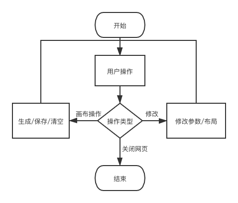
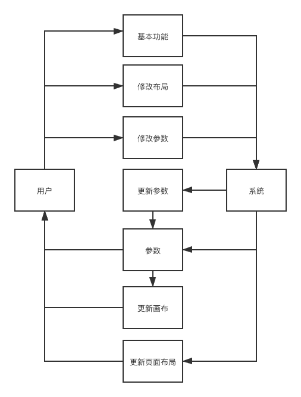

# 概要设计

[TOC]

## 1 综述

### 1.1 背景目的

* 平安好医生提供题目，用于校招考核
* 练习 web 前端编写与设计能力

### 1.2 基本环境

项目基于以下规范、语言、框架及库实现：

* HTML(5)
* CSS(3)
* JavaScript
* BootStrap, jQuery, JsBarcode, Node-QRCode

项目包含编写的 .html, .css, .js 文件各一个，以及一个 qrcode 文件夹用于引用 Node-QRCode 库。其余库皆通过 CDN 引用。

### 1.3 运行环境

版本较新的 Chrome, Firefox, IE, Safari 等主流浏览器皆可。

参考版本：

* Chrome 9+
* Firefox 12+
* Internet Explorer 9+
* Safari 5+

## 2 总体设计

### 2.1 文件结构

``` 
|-- TinyCode
    |-- .DS_Store
    |-- .gitattributes
    |-- DESIGN.md
    |-- README.md
    |-- index.html
    |-- qrcode
    |   |   
    |   ...   
    |-- scripts
    |   |-- index.js
    |-- styles
        |-- styles.css
        
// 此处省略了 qrcode 库中的文件
```

### 2.2 功能设计

#### 2.1.1 二维码

在 .js 文件中声明了一个 qrOptions 对象，并初始化了各项参数。

| 名称     | 操作         | DOM 事件 | 说明                                              |
| -------- | ------------ | -------- | ------------------------------------------------- |
| 容错     | 修改列表选项 | onchange | 更改参数中的容错级别                              |
| 前景     | 修改输入颜色 | onchange | 更改参数中的前景颜色                              |
| 背景颜色 | 修改输入颜色 | onchange | 更改参数中的背景颜色                              |
| 背景透明 | 点击按钮     | onclick  | 更改参数中的背景颜色透明度，隐藏/显示背景颜色选项 |
| 大小     | 滑动滑块     | oninput  | 更改参数中的宽度（高度）                          |
| 留白     | 滑动滑块     | oninput  | 更改参数中的外边界                                |
| 自动选择 | 点击按钮     | onclick  | 更改参数中的版本或掩码，隐藏/显示对应选项         |
| 版本     | 滑动滑块     | oninput  | 更改参数中的版本                                  |
| 掩码     | 滑动滑块     | oninput  | 更改参数中的掩码                                  |

#### 2.1.2 条形码（code 128）

在 .js 文件中声明了一个 barOptions 对象，并初始化了各项参数。

| 名称         | 操作         | DOM 事件 | 说明                                        |
| ------------ | ------------ | -------- | ------------------------------------------- |
| 粗度         | 滑动滑块     | oninput  | 更改参数中的条码宽度（最小单位值）          |
| 高度         | 滑动滑块     | oninput  | 更改参数中的条码高度                        |
| 留白（条码） | 滑动滑块     | oninput  | 更改参数中的条码留白（包含文本）            |
| 线条         | 修改输入颜色 | onchange | 更改参数中的条码颜色                        |
| 背景         | 修改输入颜色 | onchange | 更改参数中的背景颜色                        |
| 隐藏文本     | 点击按钮     | onclick  | 更改参数中的文本显示，隐藏/显示文本相关选项 |
| 样式         | 点击按钮     | onclick  | 更改参数中的字体样式                        |
| 字体         | 修改列表选项 | onchange | 更改参数中的字体种类                        |
| 对齐         | 点击按钮     | onclick  | 更改参数中的文本对齐（行内）                |
| 位置         | 点击按钮     | onclick  | 更改参数中的文本位置                        |
| 大小         | 滑动滑块     | oninput  | 更改参数中的字体大小                        |
| 留白（文本） | 滑动滑块     | oninput  | 更改参数中的文本留白（与条码之间的空白）    |

#### 2.1.3 其他

在 .js 中声明并初始化了：

* qrCanvas 对象 - 处理二维码画布元素
* barCanvas 对象 - 处理条形码画布元素
* inputText 变量 - 储存当前的文本字符串
* realTime 变量 - 用于判断是否实时渲染的标志

| 名称              | 操作     | DOM 事件 | 说明                                                         |
| ----------------- | -------- | -------- | ------------------------------------------------------------ |
| 文本输入          | 输入字符 | oninput  | 修改存储的文本值                                             |
| 实时渲染          | 点击按钮 | onclick  | 修改标志的布尔值                                             |
| 全部生成          | 点击按钮 | onclick  | 使用当前参数生成二维码和条形码                               |
| 显示二维码/条形码 | 点击按钮 | onclick  | 修改二维码/条形码画布元素的显示属性，隐藏/显示画布与对应的选项组。 |
| 生成              | 点击按钮 | onclick  | 使用当前参数生成二维码/条形码                                |
| 保存              | 点击按钮 | onclick  | 将当前二维码/条形码画布绘制的图案以图片形式保存到本地，名字默认为当前时间。 |
| 清空              | 点击按钮 | onclick  | 清空二维码/条形码画布的内容                                  |

### 2.3 函数设计

#### 2.3.1 底层函数与基本功能函数

* **textInput():** 获取文本输入框内的字符串，用全局变量 inputText 存储。调用 realTimeGen()。
* **setRealTime():** 调用 changeButton(button) 修改 "实时渲染" 按钮样式，当前实时渲染标志做取反运算。
* **realTimeGen():** 判断实时渲染标志位，值为真则调用 bothGen()。
* **bothGen():** 调用 qrGen() 和 barGen() 生成二维码和条形码。
* **qrGen():** 调用 canvasClear(canvas) 清空画布；使用 Node-QRCode 库提供的方法 QRCode.toCanvas(canvas, text, [options], function(error){}) 绘制二维码。绘制过程同时进行错误判断。
* **barGen():** 调用 canvasClear(canvas) 清空画布；使用 JsBarcode 库提供的方法 JsBarCode(canvas, text, [options]) 绘制条形码。绘制过程中同时进行错误判断。
* **canvasClear(code):** 传入画布名，通过重设画布元素高度和宽度（其一就可以达到清空效果）清空画布内容。调用 isCanvasBlank(canvas) 判断是否清空并将结果打印在控制台中。
* **isCanvasBlank(canvas):** 传入画布对象，通过创建一个新的（空的）等大画布，并比较两者 .toDataURL() 得到的值，相等则表示清空。返回判断结果。
* **saveFile(data, name):** 传入 dataURL 和 文件名。创建一个元素命名空间，用 data 和 name 初始化 href 和 download 属性。为这个元素绑定一个鼠标点击事件并触发。 
* **Download(canvas):** 传入画布元素 id，将画布内容转换为 dataURL。获取当前时间作为文件名 fileName。调用 saveFile(dataURL, fileName)。
* **display(code):** 传入显示按钮名字，调用 changeButton(button), changeDisplay(container) 改变显示按钮的样式以及隐藏/显示对应的画布和选项组。调用 adjustLayout() 调整页面布局。
* **adjustLayout():** 通过显示按钮情况判断当前布局，并通过修改元素的 Bootstrap 网格类调整页面布局。
* **changeButton(buttonName):** 传入按钮元素的 id，改变按钮的样式和取值（两种，分别代表选中和未选中）
* **changeDisplay(containerName):** 传入容器元素 id，改变容器元素的显示样式值（隐藏和缺省）。

#### 2.3.2 其他函数

用于修改生成图码时传入的参数，主要分成三类：

1. **数值相关:** 所有的滑动条。传入 HTML 滑动条控件的值，转换为整数类型，并修改参数中对应的值。调用 realTimeGen()。
2. **字符相关:** 所有的列表以及选色器。传入 HTML 列表/选色器控件的值，修改参数中对应的值。调用 realTimeGen()。
3. **按钮相关:** 所有的按钮（组）。传入 HTML 按钮/按钮组空间的值，根据值的真假情况修改参数中对应的值。调用 realTimeGen()。

### 2.4 流程设计

简要的**用户流程图**：



大概的**数据流程图**：



### 2.5 页面布局

主要通过 Bootstrap 框架的网格系统进行页面布局。通过 CSS 及 JS 辅助页面布局。

#### 2.5.1 大屏设备

浏览器宽度 >= 992px时，默认设置下页面主体以三列区域的形式分布，依次分别为二维码选项组、输入输出区域、条形码选项组。输入输出区域位于页面中心，选项组分别位于两端。默认宽度比例为 1:4:1。

当隐藏二维码/条形码时，输入输出区域宽度不变，剩余的选项组宽度自适应变化。

#### 2.5.2 中屏设备

992px \> 浏览器宽度 \>= 768px 时，输入输出区域独自一行显示，二维码选项组、条形码选项组则等宽位于下方。

当隐藏二维码/条形码时，输入输出的区域宽度不变，剩余的选项组宽度自适应变化。

#### 2.5.3 小屏设备

浏览器宽度 \< 768px 时，输入输出区域、二维码选项组、条形码选项组依次各自独占一行显示。

## 3 外部接口

用户可操作的接口有：

* 文本输入域
* 参数的滑动块
* 参数的列表选项
* 参数的选色器
* 参数按钮及功能按钮
  1. 状态按钮（组）
  2. 功能按钮
  3. 单选按钮组

其中按钮浅色（灰色）状态表示未选中，深色（黑色）状态表示已选中。功能按钮不会变更到深色状态。

## 4 模块设计与数据结构

模块设计可参考 [函数设计](#2.3 函数设计)，无更整体的设计。此程序编写的部分无数据结构的设计。

## 5 其他

### 5.1 调用的库

* [Node-QRCode](https://github.com/soldair/node-qrcode) by soldair (Ryan Day)
* [JsBarcode](https://github.com/lindell/JsBarcode) by Johan Lindell
* [Bootstrap](https://github.com/twbs/bootstrap) by Bootstrap team
* [jQuery](https://github.com/jquery/jquery)  by jQuery team

其中后三个库都是通过 CDN http://www.staticfile.org/ 引用的。

页面设计上参考了 [JsBarcode](https://lindell.me/JsBarcode/)。在调用库的过程中遇到问题时还有幸得到了作者的帮助，在此非常感谢以上开源库的各位作者。
